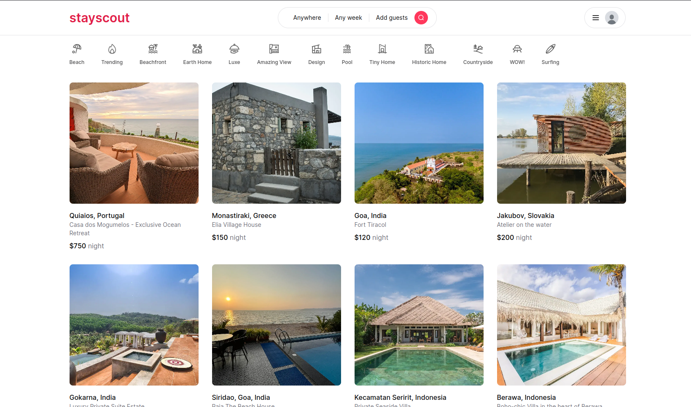

# 🏠 StayScout




Stayscout is a platform built to simplify the experience of discovering, booking, and managing accommodations. It provides a seamless experience for both hosts and guests, leveraging modern technologies for high performance and scalability.


<br>

## 📚 Usage

To use StayScout, simply follow these steps:

1. **Visit the App:**
   - Go to the live version of [StayScout](https://stayscout.vercel.app/).

2. **Sign Up / Log In:**
   - Create a new account or log in using your existing credentials via email or OAuth (Google or GitHub).

3. **Explore Listings:**
   - Browse accommodations based on your preferences.
   - Use filters to refine your search and view high-quality images and details for each listing.

4. **Book a Stay:**
   - View all the listings on the home page.
   - Select a listing, choose your dates, and proceed to book.

5. **Host a Property:**
   - List a new property by providing details, photos, and pricing.
   - Manage your listings and respond to guest inquiries.


<br>


## 🚀 Features

- **Seamless Authentication:**
  - 🔐 Kinde Authentication for passwordless login.
  - 🔑 OAuth Support with Google and GitHub, giving users flexibility in sign-in methods.

- **Listing & Booking:**
  - 🏠 Full CRUD functionality for property listings.
  - 🔍 Advanced Filtering to refine accommodation search results.
  - 📅 Booking Calendar for real-time availability.
  - 💵 Secure Payments powered by Stripe.

- **Database & Performance:**
  - 💿 Supabase Database for secure, scalable data storage.
  - 💨 Prisma ORM for efficient database operations.
  - ⚡ Optimized Caching for fast loading times and performance.

- **Deployment:**
  - **😶‍🌫️ Vercel Deployment** for fast and reliable performance, ensuring a smooth user experience.

<br>

## 📦 Technologies Used
- **Next.js** for the frontend.
- **TailwindCSS** and **Shadcn UI** for styling.
- **Kinde** for authentication.
- **Supabase** as the database backend.
- **Prisma ORM** for database queries.
- **Vercel** for deployment.

<br>

## 🏗️ Setup

To get a local copy of **Stayscout** up and running, follow these steps:

### Prerequisites

Make sure you have the following installed:

- [Node.js](https://nodejs.org/) (v16+)
- [npm](https://www.npmjs.com/) or [yarn](https://yarnpkg.com/)
- [Kinde](https://kinde.com/) authentication setup
- [Supabase](https://supabase.com/) project and keys

### Installation

1. Clone the repository:
   ```bash
   git clone https://github.com/abhish7k/stayscout.git

2. Navigate to the project folder:
    ```bash
    cd stayscout

3. Install dependencies:
    ```bash
    npm install

4. Set up environment variables:
    
    - You can use the provided .env.example file by copying it to .env.local:
      
    ```bash
    cp .env.example .env.local

5. Run the development server:
    ```bash
    npm run dev

6. Visit http://localhost:3000 to view the app.


